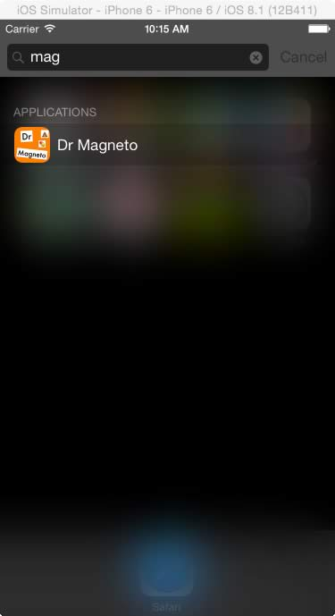

# Project 1 - Magnetic Poetry App
- Goal: To build a Magnetic Poetry App with a feature set designed by you (and optionally a partner)

## I. Requirements

- Each partner individually completes the *Magneto Exercise* and posts it to mycourses (see dropbox for due date)
- Get a partner and post your names to the discussion thread. (see discussion thread for due date)

<a id="checkpoint1"></a>

### Required App Features for Checkpoint #1 (see dropbox for due date)
***This is worth 10% of the Project 1 grade***

  - For this first deliverable, make sure that both partners do (or attempt) ALL of the coding requirements
  - The app is universal and runs on both iPhone and iPad. (*-2% if not done*)
  - The app uses Xcode 10.x/Swift 5/iOS 12.x (*-2% if not done*)
  - The app will start up with a set of related words on the screen - see mycourses for word sets, or come up with your own. (*-2% if not done*)
  - The words are draggable. (*-2% if not done*)
  - At startup, the word magnets will be neatly grouped near the top of the screen (*see screenshot below*). Write code that places the magnets in rows, and puts space between words and the rows. To do this you will need to access the width and height of the magnets (labels) so that you know how tall to make your rows, and when you've run out of room on a row. (*-5% if not done*)
  - All word labels will have exactly the same height which is `label.frame.size.height`, and differing widths which is `label.frame.size.width` (*-3% if not done*)
  
*Tip: This might be a little tricky for you. Both partners should first attempt to do this by themselves. Ideally if you both get it working, you can submit the "best" solution.*
			
- The *Magneto* word magnets are too small, especially the ones with a single character. Solution: Add a space to both of the ends of each label's text, then center align the text in the label. (*-3% if not done*)
 - Use a larger font size when creating word magnets for an iPad. You can either:
    - look at the width or height of the screen and base the font size on that value OR
    - check to see the device's "user interface idiom" - see this Stack Overflow post - http://stackoverflow.com/questions/24059327/detect-current-device-with-ui-user-interface-idiom-in-swift
    - Be sure that the words can still fit on the smallest iPhone screens available in the simulator (the iPhone SE)
- The app has a custom App icon - designed and created by you - for all iPad and iPhone sizes. [Here is a tutorial on how to create an app icon](https://designmodo.com/ios-app-icon-photoshop). If you already have an image file you think could work as your icon (at least 1024x1024 pixels ideally), services like https://makeappicon.com/ios12icon will generate all of the required icon sizes for you. (*-3% if not done*)
- Create a start up screen (on LaunchScreen.storyboard) that has the name of your app and your team members on it. Use an image (drag out a `UIImageView`), use auto-resizing or auto-layout to position it, and make sure it looks good on both iPhone and iPad. (*-3% if not done*)
- BOTH partners bring the app to class installed on their iOS hardware (*-3% if not done*)

<hr><hr>

<a id="checkpoint2"></a>

### Required App Features for Checkpoint #2 (see dropbox for due date)
***This is worth 10% of Project 1 grade***

- The user can load at least 3 distinct sets of words. (see the *Tables I-III Walkthrough* for ideas on how to let the user choose something from a list). Because multiple view controllers will depend on the same data, ideally you have 
			that data stored in just one place. 
			Also, use some  emojis if you like  -  <a href="http://getemoji.com">http://getemoji.com</a> & <a href="http://emojipedia.org">http://emojipedia.org</a> - (<i>-6 if not done</i>)</li>
			<li>Before loading a new word set the app needs to get rid of all of the old <code>UILabel</code>s. See this <a href="http://stackoverflow.com/questions/24312760/swift-how-will-i-remove-all-the-subviews-of-a-view/28516228#28516228">Stack Overflow post</a> on how to do this. (<i>-3 if not done</i>)</li>
			<li>When new word sets are loaded, make sure that the words are not too close to the top or edges of the screen for the user to tap. Test for this fact on a real device. (<i>-2 if not done</i>)</li>
			<li>Hide the status bar - you can do this on the main settings page for the app (<i>-2 if not done</i>)</li>
			<li>Make sure your app name matches the name on the icon  - see <a href="https://developer.apple.com/library/content/qa/qa1823/_index.html">developer.apple.com - Updating the Display Name of Your App</a> (<i>-2 if not done</i>)</li>
			<li>Get rid of all compiler warnings - including those for unused variables, missing icons, and broken Storyboard constraints (<i>-1 per compiler warning</i>)</li>
			<li>Make sure you still meet all of the checkpoint #1 requirements (<i>-1 per requirement not met</i>)</li>
		</ol>
	</li>

<hr><hr>

### Required Final App Features  (see dropbox for due date)
***Late submissions will be not accepted***

- The app should by now been thoroughly tested on iOS hardware:
  - The app should display properly on either landscape OR portrait orientation, and on both iPhone and iPad. I recommend choosing one orientation for the app, either portrait or landscape, and making that the sole orientation of the app
  - There should be no obvious usability issues
  - State Preservation. The user's current chosen category will be stored in `UserDefaults`, and the chosen word set will be displayed when they launch the app
- The user can share their poetry (a screenshot of the entire poem) with others using Social Networks with the `UIActivityViewController` class
- The user can choose a poetry background image from their Photo Library with the `UIImagePickerController` class
- The app meets all requirements of checkpoints #1 and #2 (*-5% per requirement not met*)
- Because multiple view controllers will depend on the same data, you have a [Singleton](https://developer.apple.com/library/content/documentation/General/Conceptual/DevPedia-CocoaCore/Singleton.html) [*model class*](https://developer.apple.com/library/content/documentation/General/Conceptual/DevPedia-CocoaCore/ModelObject.html) that manages/contains your application data
- Code Conventions
  - Class names are capitalized, instance variables begin in lowercase (*-1 per incidence*)
  - Code files in the Xcode *Project Navigator* are organized in groups for example, *VC*, *Model*, *Lib*, *Helpers*, *Extensions* etc...(*-5 if not done*)
  - Get rid of all compiler warnings - including those for unused variables, missing icons, and broken Storyboard constraints (*-1 per compiler warning*)
  - Use `//MARK: - Some Category -` in your view controller classes to organize your code - possible categories include:
    - `ivars`
    - `Private Helper Methods`
    - `Storyboard Action Methods`
    - `Initialization`
    - `View Lifecycle`
    - `GestureRecognizer Action Methods`
    - `UIImagePickerController Delegate Methods`
    - and so on
  - If the app crashes, there will be an additional penalty of -10%

<hr><hr>

## II. Extra Features:

- Doing all of the above gets an 85% - to get a higher grade you need to go "above and beyond". Be sure to document your extras in a seperate file or in the comments field of the dropbox. If you don't, you will not get credit for them. Here are some ideas:
  - Add Word to existing word set/Make new word set
  - Use the [RiTaJS](https://rednoise.org/rita/) Computational Literature API to add random words with certain characteristics: rhyming, alliteration, synonyms - etc... See the *JSTester* Demo in mycourses for help on how to get started with this API
  - Delete Words, and animate it - look at *Hello RIT-2*
  - Rotate words - see *GestureRecognizer Demo* in mycourses
  - Custom Fonts - use a `UIPickerView` - see this tutorial - http://codewithchris.com/uipickerview-example/
  - Slider for Font Size - use a `UISlider` see this tutorial - http://sourcefreeze.com/ios-slider-uislider-example-using-swift
  - UI Animation - go back and look at *Hello RIT-2*
  - If the app force-quits, the user's last poem should be preserved, the previous background image will be restored, and all of the word magnets should be in the same location
  - you decide!!! ...

<hr><hr>

## III. Handy Links
- Some examples of previous Magnet projects and best practices are here: [Project-1-comments.pdf](./_images/Project-1-comments.pdf)
- [Magnetic Poetry](http://magneticpoetry.com/pages/play-online)
- [Lovecraftian Letters](http://forum.rpg.net/showthread.php?590734-Lovecraftian-Letters-HPL-Fridge-Magnet-Set-Preorder-Special)
- http://getemoji.com
- http://emojipedia.org
- http://nshipster.com/uiactivityviewcontroller/
- https://developer.apple.com/library/ios/documentation/UIKit/Reference/UIActivityViewController_Class/index.html
- https://developer.apple.com/library/ios/documentation/UIKit/Reference/UIActivity_Class/index.html

<hr><hr>

## IV. Code Hints

### Hint #1
The easiest way to add spaces to your magnets is to do so right after you create the label  - and to use string interpolation like so in your label creation loop:
`label.text = " \(word) "`

### Hint #2
- Animating your magnets when they first appear on the screen or when a word category is changed is a nice effect. Below is code that I have running in my `placeWords()` method - in the loop that creates the magnets
- All of the words are initially placed at random location on the screen, with 0.5 opacity, and then moved to their proper calculated position in the animations: block below:

(The `center` variable is each word's proper ending position.)

```swift
// adapted from "Hello RIT II" ICE
UIView.animate(withDuration: 1.0,
    delay: 0.0,
    options: UIViewAnimationOptions.curveEaseInOut,
    animations: {
       l.layer.opacity = 1.0
       l.center = center
    },
    completion: nil
 )
```
 
### Hint #3
- Hint #2 above works well when the magnet view first loads, and works fine on an iPad, but if you change the word category on an iPhone, and then return to the main magnet screen, the category has changed but the animation never happens
- I found a work around that uses the Grand Central Dispatch API (which we have not covered) to fire the animation 10 milliseconds after the words are added to the screen

```swift
let fireTime = DispatchTime.now() + .milliseconds(10)
DispatchQueue.main.asyncAfter(deadline: fireTime){
    // UIView.animate() code goes here
     print("code will fire in 10 milliseconds)
} // trailing closure syntax!
```

### Hint #4
*Sick of everything in your app being gray?*

`UIAppearance` is a protocol on many UIKit classes that allows you to change the styling of UI elements for either your entire app, or just for for specific elements. Here is an easy quick start:

- Add the following to the `application - didFinishLaunchingWithOptions()` method in **AppDelegate.swift**:

```swift
// be sure to pick better colors!
UINavigationBar.appearance().backgroundColor = UIColor.green
let barTintColor = UIColor(red: 20/255, green: 160/255, blue: 160/255, alpha: 1)
UIToolbar.appearance().barTintColor = barTintColor
UIBarButtonItem.appearance().tintColor = UIColor.purple
```

- See the "Using UIAppearance" PDF in mycourses
- See this tutorial for an introduction: https://www.raywenderlich.com/1625-uiappearance-tutorial-getting-started


### Hint #5

See the **UIInterpolatingMotionEffect Notes** PDF in mycourses to see how to add "kinetic realism" to your app. Put the effect on each word when you add them to the scene, and make the effect subtle


### Hint #6
- When doing the final testing your app, be sure to delete it off of the simulator and your iOS device, reinstall it, and be sure that it works in the "first run" state.
- This is necessary to do so that you can be 100% sure that your `UserDefaults` code is properly written

### Hint #7

- for dependency injection, create the `ViewController` progrmmatically, in `AppDelegate.swift`

```swift
 self.window = UIWindow(frame: UIScreen.main.bounds)
        
 // In project directory storyboard looks like Main.storyboard,
 // you should use only part before ".storyboard" as it's name,
 // so in this example name is "Main".
 let storyboard = UIStoryboard.init(name: "Main", bundle: nil)
        
// controller identifier sets up in storyboard utilities
// panel (on the right), it called Storyboard ID
let viewController = storyboard.instantiateViewController(withIdentifier: "viewController") as! ViewController
viewController.wordListMgr = WordListManager.shared
viewController.selectedCategory = WordListManager.shared.currentCategory
        
self.window?.rootViewController = viewController
self.window?.makeKeyAndVisible()
```

<hr><hr>

<a id="screenshots"></a>

## V. Screenshots

### V-A. Checkpoint #1

**Splash Screen:**


**Main Screen:**


<hr>

### V-B. Checkpoint #2

**Main Screen iPhone:**


**Category Screen iPhone:**


**Main Screen iPad:**


<hr>

### V-C. Final Deliverable

**iPad - Choose a Word Set popover**


<hr>

**iPad Change Font Size popover**


<hr>

**Toolbar iPhone**


<hr>

**iPhone - Choose a Word Set VC**


<hr>

**iPhone - Change Font Size VC**


<hr>




